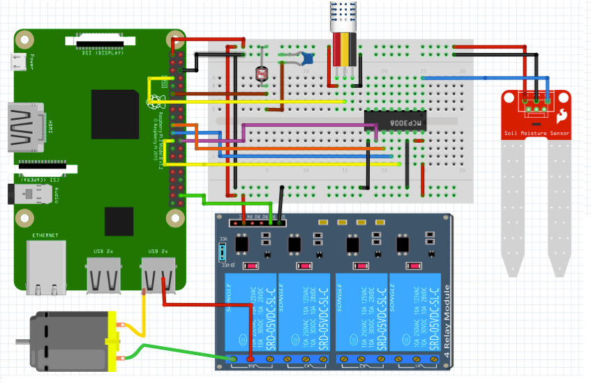

# Smart Garden
Smart Garden - IoT Project

## About
The smart garden monitors the temperature, humidity, light levels and soil moisture of the plant. It has an automated system that waters the plant when the soil moisture is below an specific value and switches on the fan when the air temperature or humidity are below or above an specific value. This maintains an ideal and consistent soil condition for the plant, and makes it convenient for those who tend to forget to water their plants regularly.

We will be using a Raspberry Pi to receive data from the sensors and control the different actuators. The surrounding temperature, air humidity and brightness and soil moisture values will be recorded. These values will then be displayed on a web page, which allow users to know the environmental conditions of the plants when they check on them.

When the soil moisture level goes below the user input, and the automatic button is tuned on, the water pump will start to run and pump water into the soil automatically. This is very convenient for users as they do not need to water their plants every time but instead let the system water their plants automatically based on the moisture level of the soil.

As for the fans, when the temperature is above the specific or the air humidity is below the specified, the fans will turn on to allow the exchange of air with the outside environment. Mind that the system is inside of a Hydroponic tent.

The Light will be turned on constantly based on time (3, 6 or 9 hours) as manual input on the own light timer.

The temperature, humidity, light levels and soil moisture values will also be published to DynamoDB. Through a server (Raspberry Pi), the data will be displayed onto a flask web page where it shows real-time data coming from the sensors. This will allow users to view the real-time environmental conditions of the plants on the go (the latest 15 records through a graph).

The web page will also allow users to control the water pump and fans whenever the user decide, based on the automatically or manually input. The web page also counts with authorization based on username and password stored in a Cognito UserPool.

The user can also change the inputs values for turning on the fans and the water pump on the web page. By choosing Setting, the user can change the values of temperature, air humidity and moisture.

The user is also able to control the system using Alexa assistant. Check the SmartGarden CodeStar [project](https://github.com/wenzaca/SmartGardenAlexa) for more information.

The wep page server that runs on the EC2 instance PI is available on a third [project](https://github.com/wenzaca/SmartGarden).

### Hardware
- [Raspberry Pi 3 Model B+](https://www.raspberrypi.org/products/raspberry-pi-3-model-b-plus/#c-find-reseller)
- [Relay shield 4 ports](https://www.amazon.co.uk/s?k=relay+shield+4+channel)
- [DHT22](https://www.amazon.co.uk/s?k=dht22)
- [Moisture Sensor](https://www.amazon.co.uk/s?k=moisture+sensor+module)
- [UV Light](https://www.amazon.co.uk/s?k=uv+lights+for+growing+plants+indoors)
- [DC Water Pump](https://www.amazon.co.uk/s?k=dc+water+pump)
- [LDR](https://www.amazon.co.uk/s?k=ldr)
- [MCP3008](https://www.amazon.co.uk/s?k=mcp3008)
- [Hydroponic Tent](https://www.amazon.co.uk/s?k=hydroponic+tent)
- Electronic Components (capacitors, resistors)

Plug the sensor on the following ports:


- Relay Board Watering: Pin 38 (GPIO20).
- Relay Board Fans: Pin 40 (GPIO21).
- [Moisture](https://tutorials-raspberrypi.de/wp-content/uploads/2015/11/hygrometer_Steckplatine.png) (Raspberry/MCP3008):

    | Raspberry     | MCP3008         | 
    | ------------- |:---------------:| 
    | Pin 1 (3.3V)  | Pin 16 (VDD)    |
    | Pin 1 (3.3V)  | Pin 15 (VREF)   | 
    | Pin 6 (GND)   | Pin 14 (AGND)   |
    | Pin 23 (SCLK) | Pin 13 (CLK)    |
    | Pin 21 (MISO) | Pin 12 (DOUT)   |
    | Pin 19 (MOSI) | Pin 11 (DIN)    |
    | Pin 24 (CE0)  | Pin 10 (CS/SHDN)|
    | Pin 6 (GND)   | Pin 9 (DGND)    |
- Light: Connect to USB port from the Raspberry.
- Fans: USB port Raspberry and open wire on Relay.
- Pump: USB port Raspberry and open wire on Relay.
- LDR: 3.3V, pull up capacitor of 1uF to ground and Pin 11 (GPIO 27).
- DHT22: 

    | Raspberry      | DHT22        | 
    | -------------- |:------------:| 
    | Pin 1 (3.3V)   | Pin 1 (VDD)  |
    | Pin 7 (GPIO4)  | Pin 2 (VREF) | 
    | Not Connected  | Pin 3        |
    | Pin 6  (GND)   | Pin 4 (GND)  |
    
 Note: DHT22 Pin 2 need to have pull up resistor (4.7k – 10kΩ)
 
## Schematic:
 

 

### Cloud
- AWS IoT:
    - Things:
        - Raspberry_Listener
        - Raspberry_Core
        - Raspberry_Readings
    - Topics:
        - smartgarden/status
        - smartgarden/maxdata
        - smartgarden/readings
        - smartgarden/watering
        - smartgarden/fans
    - Act (Rules):
        - smartgarden_status
        - smartgarden_fans
        - smartgarden_watering
        - smartgarden_readings
        - smartgarden_maxdata
    - Certificate
- DynamoDB:
    - smartgarden_maxdata (id)
    - smartgarden_readings (id, date)
    - smartgarden_status (id, date)
- Cognito UserPool
- EC2
- Route 53
- Alexa Custom Skill
- Lambda Function for the Custom Skills

## Schematic


## How to run
Ensure to have:
- Installed python3.
- Installed and configured your AWS CLI (with a role that has permission to access Dynamodb and AWS IoT).
- Created folders:
    - /certs
        - certificate.pem.crt
        - private.pem.key
        - rootca.pem
    - /log
    - Virtual Environment
        - ```python3 -m venv .venv```
        - ```source .venv/bin/activate```

To run:
- Script (readings):
    - ```pip3 install -r requirements.txt -t .```
    - ```sudo nohup python3 script.py &```
    
Useful commands:
- Get IP: ```ping raspberrypi.local```
- Connect: ```ssh pi@IP```
- Transfer File: ```scp filename pi@IP:/home/pi```
- Find server process (MAC): ```netstat -vanp tcp | grep 5000```
- Kill process: ```kill [port number]```

## References
- [Project Reference](https://www.hackster.io/mokxf16/smart-garden-raspberry-pi-arduino-65c7b7)
- [Weppage Server](https://github.com/wenzaca/SmartGarden)
- [Alexa Custom Skill](https://github.com/wenzaca/SmartGardenAlexa)
- [Moisture](https://tutorials-raspberrypi.com/measuring-soil-moisture-with-raspberry-pi)
- [DHT22](https://tutorials-raspberrypi.com/raspberry-pi-measure-humidity-temperature-dht11-dht22)
- [LDR](https://pimylifeup.com/raspberry-pi-light-sensor)
- [Relay](https://tutorials-raspberrypi.com/raspberry-pi-control-relay-switch-via-gpio)
